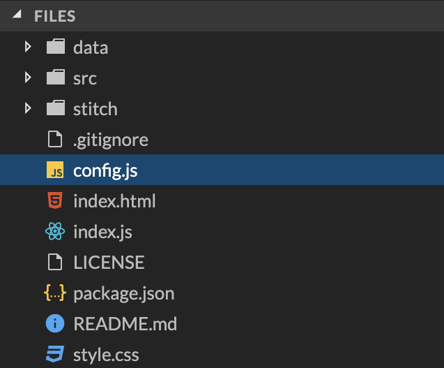

# Build Web Apps Faster Using Stitch Rules & React
_Author_: [Robbert Kauffman](mailto:robbert.kauffman@mongodb.com)

## Introduction

Modern web applications are often built using API-based front-ends such as React, Angular, 
VueJs. In this session, we will dive into how Stitch can be used to provide APIs for your 
front-end, removing the need for writing and maintaining boilerplate back-end services, and 
having to manage and scale back-end servers. All to make developer’s lives easier.

## Step 1 — Creating a Stitch App

In [Atlas](https://cloud.mongodb.com):
1. Navigate to _Stitch_ using the left hand navigation
2. Click _Create New Application_
3. In the dialog window, name the app, select one of your Atlas clusters to link it, and hit 
_Create_.

## Step 2 — Setting up Stitch App

- Open your app by selecting it from the Stitch Applications list
- On the Getting Started screen: Turn on Anonymous Authentication 

- Copy your Stitch App ID in top-left corner

## Step 3 — Setting up MongoMart Front-end

- Go to https://stackblitz.com/edit/mongomart-world-session-1
  - StackBlitz is an online IDE and app server for easily editing code and running apps online

## StackBlitz

*Warning*: changes are not saved on closing tab/browser. Click Fork (1) and write down the new URL if you want changes to be saved

## Step 4 — Setting up MongoMart Front-end

- Edit config.js: change value of Stitch app ID on line 2 to your Stitch App ID

- Click on Open in New Window on top-right. Your screen should look like this:

- Reload page if you get the following error: "default app can only be set once; currently 
set to 'XXX’"

## Exercise 1.1 — Adding a read-rule

- Go to your Stitch app
- Go to _Rules_
- Create a new rule by clicking on … and _Add Database/Collection_

  - Enter *mongomart* as database name, and press return or click on _Create_
  - Enter *item* as collection name, and press return or click _Create_
  
  - Select _Users can only read all data_ as template
  - Click the green _Add collection_ button at the bottom
- Go back to the live app and reload: do you see any products?

## Exercise 1.2 — Temporary permissions for Importing data

- Go back to the item-rule in _Rules_ in your Stitch App
- Enable write-permissions by checking the _Write_ checkboxes
- Edit the _default_ (1) permissions and:

  - Enable _Insert Documents_ and _Delete Documents_
  
  - Click _Done Editing_
- Don’t forget to click _Save_ on the top right
- Go back to the live app and:
  - Click the _Import Items_ link in the footer
  - Reload
  - Products should now be visible!
  

## Exercise 1.3 — Fixing the rule

- Go back to the item-rule in _Rules_ in your Stitch App
- Disable the write-permissions by unchecking the _Write_ checkboxes
- Don’t forget to click _Save_ on the top right
- All set now!

## Exercise 2 — Adding a write-rule

- Go back to _Rules_ in your Stitch App
- Create a new rule by clicking on … and _Add Database/Collection_
  - Enter *mongomart* as database name
  - Enter *users* as collection name, and press return or click _Create_
  - Select _Users can only read and write their own data_ as template
  - Enter *_id* for field name for User ID
  - Click the green _Add collection_ button at the bottom
- Go back to live app, reload, and:
  - Cart should now be visible and you should be able to add products to cart from product 
  detail pages!

## Exercise 3 — Adding a Stitch function

- Go to _Functions_ in your Stitch App
- _Create New Function_
  - Use the name *setNotification* (case sensitive)
  - Check the _Run As System_ toggle
  - Click _Save_
  - Copy + paste code from _stitch/setNotification.js_ from app in Stackblitz
  - Click _Save_
- Go back to live app, reload, and:
  - View the Coffee Mug detail page and click on _Notify me when in stock_